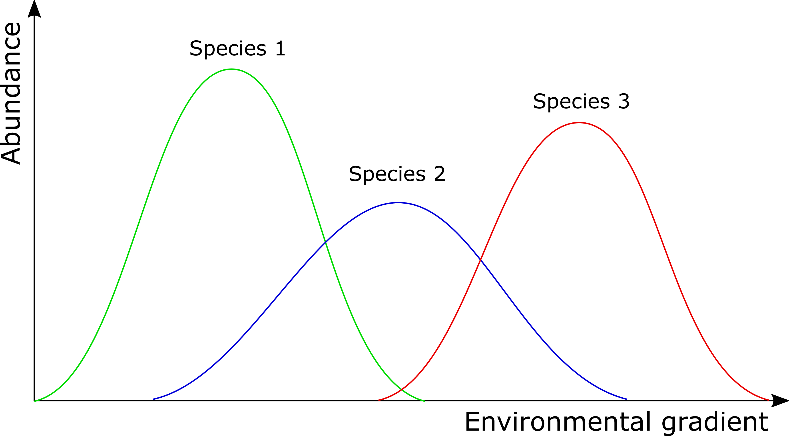
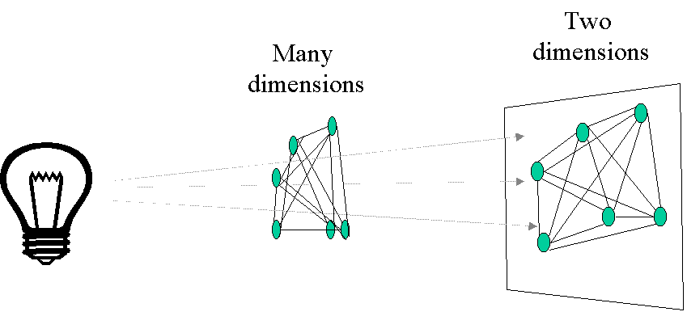
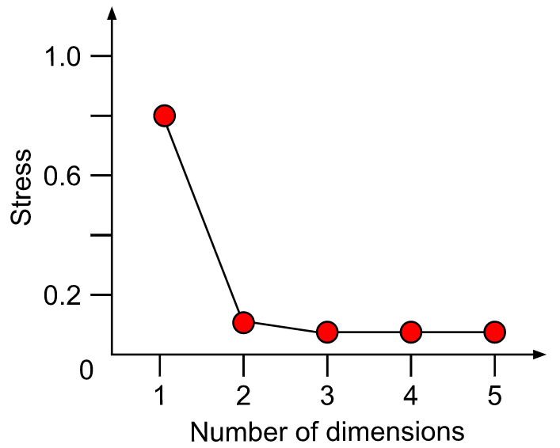

```{r setup, message=FALSE}
knitr::opts_chunk$set(echo = TRUE)
library(vegan)
library(ape)
library(tidyverse)
library(vroom)
library(recluster)
library(phytools)
library(stats)
library(cluster)
library(viridis)
```

## Purpose
This is a follow-along document reporting my engagement with Coding Club's [Introduction to ordination](https://ourcodingclub.github.io/tutorials/ordination/index.html) tutorial. Not everything in the tutorial should be expected to be replicated here.

## Tutorial aims
In this tutorial, we will learn to use ordination to explore patterns in multivariate ecological datasets. We will mainly use the vegan package to introduce you to three (unconstrained) ordination techniques: Principal Component Analysis (PCA), Principal Coordinate Analysis (PCoA) and Non-metric Multidimensional Scaling (NMDS).

## 1. What is ordination?

### Goals of ordination

Ordination is a collective term for multivariate techniques which summarize a multidimensional dataset in such a way that when it is projected onto a low dimensional space, any intrinsic pattern the data may possess becomes apparent upon visual inspection (Pielou, 1984).

In ecological terms: Ordination summarizes community data (such as species abundance data: samples by species) by producing a low-dimensional ordination space in which similar species and samples are plotted close together, and dissimilar species and samples are placed far apart. Ideally and typically, dimensions of this low dimensional space will represent important and interpretable environmental gradients.

Generally, ordination techniques are used in ecology to describe relationships between species composition patterns and the underlying environmental gradients (e.g. what environmental variables structure the community?). Two very important advantages of ordination is that 1) we can determine the relative importance of different gradients and 2) the graphical results from most techniques often lead to ready and intuitive interpretations of species-environment relationships.

To give you an idea about what to expect from this ordination course today, we’ll run the following code.
```{r}
# Load the community dataset wich we'll use in the examples today
data(varespec)

# Open the dataset and look if you can find any patterns
# It is probably very difficult to see any patterns by just looking at the data frame!

# With this command, you'll perform a NMDS and lot the results.
varespec %>% 
  metaMDS(trace = F) %>% 
  ordiplot(type = 'none') %>% 
  text('sites')
```

### Ordination vs. classification
Ordination and classification (or clustering) are the two main classes of multivariate methods that community ecologists employ. To some degree, these two approaches are complementary. Classification, or putting samples into (perhaps hierarchical) classes, is often useful when one wishes to assign names to, or to map, ecological communities. However, given the continuous nature of communities, ordination can be considered a more natural approach. Ordination aims at arranging samples or species continuously along gradients.

If you want to know how to do a classification, please check out our Intro to data clustering.

## 2. Different ordination techniques
In this section you will learn more about how and when to use the three main (unconstrained) ordination techniques:

+ Principal Component Analysis (PCA)
+ Principal Coordinate Analysis (PCoA)
+ Non-metric Multidimensional Scaling (NMDS)

### 2a. Principal Component Analysis (PCA)
PCA uses a rotation of the original axes to derive new axes, which maximize the variance in the data set. In 2D,  this looks as follows:


Computationally, **PCA is an eigenanalysis**. The most important consequences of this are:

+ There is a unique solution to the eigenanalysis.
+ The axes (also called principal components or PC) are orthogonal to each other (and thus independent).
+ Each PC is associated with an eigenvalue. The sum of the eigenvalues will equal the sum of the variance of all variables in the data set. The eigenvalues represent the variance extracted by each PC, and are often expressed as a percentage of the sum of all eigenvalues (i.e. total variance). The relative eigenvalues thus tell how much variation that a PC is able to ‘explain’.
+ Axes are ranked by their eigenvalues. Thus, the first axis has the highest eigenvalue and thus explains the most variance, the second axis has the second highest eigenvalue, etc.
+ There are a potentially large number of axes (usually, the number of samples minus one, or the number of species minus one, whichever is less) so there is no need to specify the dimensionality in advance. However, the number of dimensions worth interpreting is usually very low.
+ Species and samples are ordinated simultaneously, and can hence both be represented on the same ordination diagram (if this is done, it is termed a biplot)
+ The variable loadings of the original variables on the PCA’s may be understood as how much each variable ‘contributed’ to building a PC. The absolute value of the loadings should be considered as the signs are arbitrary.

In most applications of PCA, variables are often measured in different units. For example, PCA of environmental data may include pH, soil moisture content, soil nitrogen, temperature and so on. For such data, the data must be standardized to zero mean and unit variance. For ordination of ecological communities, however, all species are measured in the same units, and the data do not need to be standardized.

Let´s have a look how to do a PCA in R. You can use several packages to perform a PCA: The rda() function in the package vegan, The prcomp() function in the package stats and the pca() function in the package labdsv. We will use the rda() function and apply it to our varespec dataset.
```{r}
PCA <- rda(varespec, scale = FALSE)
# Use scale = TRUE if your variables are on different scales (e.g. for abiotic variables).
# Here, all species are measured on the same scale 
# So use scale = FALSE

# Now plot a bar plot of relative eigenvalues. This is the percentage variance explained by each axis
barplot(as.vector(PCA$CA$eig)/sum(PCA$CA$eig))
# How much of the variance in our dataset is explained by the first principal component?

# Calculate the percent of variance explained by first two axes
sum((as.vector(PCA$CA$eig)/sum(PCA$CA$eig))[1:2])

# Also try to do it for the first three axes
sum(as.vector(PCA$CA$eig/sum(PCA$CA$eig))[1:3])

# Now, we`ll plot our results with the plot function
plot(PCA)
plot(PCA, display = 'sites', type = 'points')
plot(PCA, display = 'species', type = 'text')

# Try to display both species and sites with points.
plot(PCA, display = c('sites', 'species'), type = 'points')
```

```{r}
# You can extract the species and site scores on the new PC for further analyses:
sitePCA <- PCA$CA$u # Site scores
speciesPCA <- PCA$CA$v # Species scores

# In a biplot of PCA, species' scores are drawn as arros that point in the direction of increasing values for that variable.
biplot(PCA, choices = c(1,2), type = c('text', 'text'), xlim = c(-5, 10))
biplot(PCA, choices = c(1,3), type = c('text', 'points'), xlim = c(-5, 10))
```

In contrast to some of the other ordination techniques, species are represented by arrows. This implies that the abundance of the species is continuously increasing in the direction of the arrow, and decreasing in the opposite direction. Thus PCA is a linear method. PCA is extremely useful when we expect species to be linearly (or even monotonically) related to each other. Unfortunately, we rarely encounter such a situation in nature. It is much more likely that species have a unimodal species response curve:



### 2b. Principal Coordinate Analysis (PCoA)
Principal coordinates analysis (PCoA, also known as metric multidimensional scaling) attempts to represent the distances between samples in a low-dimensional, Euclidean space. In particular, it maximizes the linear correlation between the distances in the distance matrix, and the distances in a space of low dimension (typically, 2 or 3 axes are selected). The PCoA algorithm is analogous to rotating the multidimensional object such that the distances (lines) in the shadow are maximally correlated with the distances (connections) in the object:



The first step of a PCoA is the construction of a **(dis)similarity matrix**. While PCA is based on Euclidean distances, PCoA can handle (dis)similarity matrices calculated from quantitative, semi-quantitative, qualitative, and mixed variables. As always, the choice of (dis)similarity measure is critical and must be suitable to the data in question. If you want to know more about distance measures, please check out our [Intro to data clustering](https://ourcodingclub.github.io/tutorials/data-clustering/index.html#Distance). For abundance data, Bray-Curtis distance is often recommended. You can use Jaccard index for presence/absence data. When the distance metric is Euclidean, PCoA is equivalent to Principal Components Analysis. Although PCoA is based on a (dis)similarity matrix, the solution can be found by eigenanalysis. The interpretation of the results is the same as with PCA.
```{r}
# First step is to calculate a distance matrix.
# Here we use Bray-Curtis distance metric.
dist <- vegdist(varespec, method = 'bray')

# PCoA is not included in vegan. 
# We will use the ape package instead
PCOA <- pcoa(dist)

# Plot the eigenvalues and interpret
barplot(PCOA$values$Relative_eig[1:10])

# Can you also calculate the cumulative explained variance of the first 3 axes?
sum(PCOA$values$Relative_eig[1:3])

# Some distance measures may result in negative eigenvalues. In that case, add a correction:
PCOA <- pcoa(dist, correction = 'cailliez')

# Plot your results
biplot.pcoa(PCOA)

# You see what`s missing?  Indeed, there are no species plotted on this biplot.  That's because we used a dissimilarity matrix (sites x sites)  as input for the PCOA function.  Hence, no species scores could be calculated.  However, we could work around this problem like this:
biplot.pcoa(PCOA, varespec)
```

```{r}
# Extract the plot scores from first two PCoA axes (if you need them):
PCOAaxes <- PCOA$vectors[,c(1,2)]

# Compare this result with the PCA plot
par(mfrow = c(1, 2)) 
biplot.pcoa(PCOA, varespec)
plot(PCA)

# reset plot window
par(mfrow = c(1, 1)) 
```

PCoA suffers from a number of flaws, in particular the arch effect (see PCA for more information). These flaws stem, in part, from the fact that PCoA maximizes a linear correlation. Non-metric Multidimensional Scaling (NMDS) rectifies this by maximizing the rank order correlation.

### 2c. Non-metric Multidimensional Scaling (NMDS)
NMDS attempts to represent the pairwise dissimilarity between objects in a low-dimensional space. Any dissimilarity coefficient or distance measure may be used to build the distance matrix used as input. __NMDS is a rank-based approach.__ This means that the original distance data is substituted with ranks. Thus, rather than object A being 2.1 units distant from object B and 4.4 units distant from object C, object C is the “first” most distant from object A while object C is the “second” most distant. While information about the magnitude of distances is lost, rank-based methods are generally more robust to data which do not have an identifiable distribution.

NMDS is an iterative algorithm. NMDS routines often begin by random placement of data objects in ordination space. The algorithm then begins to refine this placement by an iterative process, attempting to find an ordination in which ordinated object distances closely match the order of object dissimilarities in the original distance matrix. The stress value reflects how well the ordination summarizes the observed distances among the samples.

NMDS is not an eigenanalysis. This has three important consequences:
+ There is no unique ordination result.
+ The axes of the ordination are not ordered according to the variance they explain.
+ The number of dimensions of the low-dimensional space must be specified before running the analysis.

There is no unique solution. The end solution depends on the random placement of the objects in the first step. Running the NMDS algorithm multiple times to ensure that the ordination is stable is necessary, as any one run may get “trapped” in local optima which are not representative of true distances. Note: this automatically done with the metaMDS() in vegan.

Axes are not ordered in NMDS. metaMDS() in vegan automatically rotates the final result of the NMDS using PCA to make axis 1 correspond to the greatest variance among the NMDS sample points. This doesn’t change the interpretation, cannot be modified, and is a good idea, but you should be aware of it.

A plot of stress (a measure of goodness-of-fit) vs. dimensionality can be used to assess the proper choice of dimensions. The stress values themselves can be used as an indicator. Stress values >0.2 are generally poor and potentially uninterpretable, whereas values <0.1 are good and <0.05 are excellent, leaving little danger of misinterpretation. Stress values between 0.1 and 0.2 are useable but some of the distances will be misleading. Finding the inflexion point can instruct the selection of a minimum number of dimensions.



**Methodology of NMDS:**

+ Step 1: Perform NMDS with 1 to 10 dimensions 
+ Step 2: Check the stress vs dimension plot 
+ Step 3: Choose optimal number of dimensions 
+ Step 4: Perform final NMDS with that number of dimensions 
+ Step 5: Check for convergent solution and final stress


```{r}
# First step is to calculate a distance matrix. See PCOA for more information about the distance measures
# Here we use bray-curtis distance, which is recommended for abundance data
dist <- vegdist(varespec, method = 'bray')

# In this part, we define a function NMDS.scree() that automatically 
# performs a NMDS for 1-10 dimensions and plots the nr of dimensions vs the stress
NMDS.scree <- function(x) {
  plot(
    rep(1,10),
    replicate(10, metaMDS(x, autotransform = F, k = 1, trace = F)$stress),
    xlim = c(1, 10),
    ylim = c(0, 0.10),
    xlab = '# of Dimensions',
    ylab = 'Stress',
    main = 'NMDS stress plot'
  )
  for (i in 2:10) {
    points(
      rep(i, 10),
      replicate(10, metaMDS(x, autotransform = F, k = i, trace = F)$stress)
    )
  }
}

# Use the function that we just defined to choose the optimal nr of dimensions
NMDS.scree(dist)
```

We further see on this graph that the stress decreases with the number of dimensions. This is a normal behavior of a stress plot. This graph doesn´t have a very good inflexion point. So here, you would select a nr of dimensions for which the stress meets the criteria. This would be 3-4 D. To make this tutorial easier, let’s select two dimensions. This is also an ok solution. Now, we will perform the final analysis with 2 dimensions

```{r}
# Because the final result depends on the initial random placement of points we'll set a seed to make the results reproducible.
set.seed(2)

# Here, we perform the final analysis and check the result
NMDS1 <- metaMDS(dist, k = 2, trymax = 100, trace = F)

# Let's check the results
NMDS1

# If you don't provide a dissimilarity matrix, metaMDS automatically applies Bray-Curtis. So in our case, the results have to be the same
NMDS2 <- metaMDS(varespec, k = 2, trymax = 100, trace = F)
NMDS2
```

The results are not the same! Can you see the reason why? metaMDS() has indeed calculated the Bray-Curtis distances, but first applied a square root transformation on the community matrix. Check the help file for metaNMDS() and try to adapt the function for NMDS2, so that the automatic transformation is turned off.

```{r}
NMDS2 <- metaMDS(varespec, k = 2, trymax = 100, trace = F, autotransform = F)
NMDS2
```

Let’s check the results of NMDS1 with a stressplot

```{r}
stressplot(NMDS1)
```

There is a good non-metric fit between observed dissimilarities (in our distance matrix) and the distances in ordination space. Also the stress of our final result was ok (do you know how much the stress is?). So we can go further and plot the results:

```{r}
plot(NMDS1, type = 't')
```

There are no species scores (same problem as we encountered with PCoA). We can work around this problem, by giving metaMDS the original community matrix as input and specifying the distance measure.

```{r}
NMDS3 <- metaMDS(varespec, k = 2, trymax = 100, trace = F, autotransform = FALSE, distance = 'bray')
plot(NMDS3)
plot(NMDS3, display = 'sites', type = 'n')
points(NMDS3, display = 'sites', col = 'red', cex = 1.25)
text(NMDS3, display = 'species')

# Alternatively, you can use the functions ordiplot and orditorp
ordiplot(NMDS3, type = 'n')
orditorp(NMDS3, display = 'species', col = 'red', air = 0.01)
orditorp(NMDS3, display = 'sites', cex = 1.1, air = 0.01)
```

## 3. Interpretation of the results
We now have a nice ordination plot and we know which plots have a similar species composition. We also know that the first ordination axis corresponds to the largest gradient in our dataset (the gradient that explains the most variance in our data), the second axis to the second biggest gradient and so on. The next question is: Which environmental variable is driving the observed differences in species composition? We can do that by correlating environmental variables with our ordination axes. Therefore, we will use a second dataset with environmental variables (sample by environmental variables). We continue using the results of the NMDS.

```{r}
# Load the second dataset
data(varechem)

# The function envfit will add the environmental variables as vectors to the ordination plot
ef <- envfit(NMDS3, varechem, permu = 999)
ef

# The two last columns are of interest: the squared correlation coefficient and the associated p-value
# Plot the vectors of the significant correlations and interpret the plot
plot(NMDS3, type = 't', display = 'sites')
plot(ef, p.max = 0.05)
```

### Hulls
It´s easy as that. Next, let’s say that the we have two groups of samples. This could be the result of a classification or just two predefined groups (e.g. old versus young forests or two treatments). Now, we want to see the two groups on the ordination plot. Here is how you do it:

```{r}
# Define a group variable (first 12 samples belong to group 1, last 12 samples to group 2)
group = c(rep('Group1', 12), rep('Group2', 12))

# Create a vectorr of color values with same length as the vector of group value
colors = c(rep('red', 12), rep('blue', 12))

# Plot convex hulls with colors based on the group identity
ordiplot(NMDS3, type = 'n')
for(i in unique(group)){
  ordihull(NMDS3$points[grep(i, group),], draw = 'polygon',
           groups = group[group == i], col = colors[grep(i, group)], label = F)
}

orditorp(NMDS3, display = 'species', col = 'red', air = 0.01)
orditorp(NMDS3, display = 'sites', col = c(rep('red', 12),
                                           rep('blue', 12)), air = 0.01, cex = 1.25)
```

Congratulations! You´ve made it to the end of the tutorial! Now you can put your new knowledge into practice with a couple of challenges.

## Challenges!
### Challenge number 1
Perform an ordination analysis on the dune dataset (use data(dune) to import) provided by the vegan package. Interpret your results using the environmental variables from dune.env.

Since no ordination method is specified, let's try all of them.
```{r}
# Load the data
data(dune)
data(dune.env)
```


#### PCA
```{r}
cPCA <- rda(dune, scale = FALSE)
barplot(as.vector(cPCA$CA$eig)/sum(cPCA$CA$eig))
sum(as.vector(cPCA$CA$eig/sum(cPCA$CA$eig))[1:2])
plot(cPCA)
biplot(cPCA, choices = c(1,2), type = c('text', 'text'))
ef_cPCA <- envfit(cPCA, dune.env, permutations = 999)
plot(cPCA, type = 't', display = 'sites')
plot(ef_cPCA, p.max = 0.05)
```

#### PCoA
```{r}
# We start by calculating the distance matrix.
c_dist <- vegdist(dune, method = 'bray')
cPCOA <- pcoa(c_dist)

# Then visualize the eigenvalues to check whether negative eigenvalues are present. Negative eigenvalues are associated with non-euclidean space.
print(as.vector(cPCOA$values$Relative_eig))

# There are negative values so a correction is needed. Let's just use cailliez as in the tutorial.
cPCOA <- pcoa(c_dist, correction = 'cailliez')

# See how much of the variance in the distance matrix is explained by the first two principal coordinates that wea are going to use anyway.
cPCOA$values$Cum_corr_eig[1:2]
sum(cPCOA$values$Rel_corr_eig[1:2])

# Use a barplot to visualize more of the variance attributed to each principal coordinate.
barplot(as.vector(cPCOA$values$Rel_corr_eig))
barplot(as.vector(cPCOA$values$Cum_corr_eig))

# We proceed to plot the biplot with labels from the original dataset.
biplot.pcoa(cPCOA, dune)

# Let's now fit the environmental variables.
site_scores_pcoa <- cPCOA$vectors[, 1:2]
ef_cPCOA <- envfit(site_scores_pcoa, dune.env, permutations = 999)

# Show plots.
ordiplot(site_scores_pcoa, type = 'text', cex = .8)
plot(ef_cPCOA, p.max = 0.05, col = 'blue', cex = 0.9)
```

#### NMDS
Quick recap on the NMDS steps:
+ Step 1: Perform NMDS with 1 to 10 dimensions 
+ Step 2: Check the stress vs dimension plot 
+ Step 3: Choose optimal number of dimensions 
+ Step 4: Perform final NMDS with that number of dimensions 
+ Step 5: Check for convergent solution and final stress

```{r}
# Steps 1 and 2:
NMDS.scree2 <- function (x) {
  # Step 1: Perform NMDS with 1 to 10 dimensions.
  a <- list()
  for (i in 1:10) {
    a[[i]] <- replicate(
      10, 
      metaMDS(x, autotransform = F, k = i, trace = F)
    )
  }
  
  # Step 2: Check the stress vs dimension plot.
  ytemp = c()
  for (i in 1:10){
    ytemp[i] <- a[[1]][, i]$stress
  }
  
  plot(
    x = rep(1, 10),
    y = ytemp,
    xlim = c(1, 10),
    ylim = c(0 ,.3)
  )
  
  for (i in 2:10){
    ytemp2 = c()
    for (j in 1:10){
      ytemp2[j] <- a[[i]][, j]$stress
    }
    points(
      rep(i, 10),
      ytemp2
    )
  }
  
  return(a)
}

c_NMDS_result <- NMDS.scree2(c_dist)
```

```{r}
# Step 3: Choose the optimal number of dimensions.
# In this case we can see that 2 dimensions is between 0.1 and 0.2 stress which is usable according to the tutorial but will produce misleading distances. We were going to use 2 dimensions anyways so I am just acknolwedging the limitations of choosing 2 dimensions.

# Step 4: Perform final NMDS with that number of dimensions. In this case, 2 dimensions.
c_NMDS <- metaMDS(dune, k = 2, trymax = 100, trace = F, autotransform = F, distance = 'bray')

# Step 5: Check for a convergent solution and final stress.
print(c_NMDS)
```

```{r}
# We can also perform a stressplot.
stressplot(c_NMDS)

# We can also produce a biplot.
plot(c_NMDS, type = 't', cex = 1.1)

# We can make it more elaborate. However, this one leaves out information compared to the simple approach.
plot(c_NMDS, display = 'sites', type = 'n')
points(c_NMDS, display = 'sites', col = 'red', cex = 1.25)
text(c_NMDS, display = 'species')

# We can also use the ordiplot and orditorp functions.
ordiplot(c_NMDS, type = 'n')
orditorp(c_NMDS, display = 'species', cex = 0.8, col = 'red', air = 0.01)
orditorp(c_NMDS, display = 'sites', cex = 0.8, air = 0.01)
```

```{r}
# Lastly, we can also fit environmental variables and visualize the fit as a biplot.
c_mnds_ef <- envfit(c_NMDS, dune.env, permutations = 999)
c_mnds_ef

# Straightforward plot with significant correlations.
plot(c_NMDS, type = 't', display = 'sites')
plot(c_mnds_ef, p.max = 0.05)
```

### Challenge number 2
If you already know how to do a classification analysis, you can also perform a classification on the dune data. Then combine the ordination and classification results as we did above. Please have a look at out tutorial Intro to data clustering, for more information on classification.

First, let's try first the phylo tree approach. This approach involves clustering the data with `recluster.cons` to generate a `phylo` object. Then, one selects an appropriate level to cut the tree so that relevant clads are identified.
```{r}
set.seed(123)
# Convert the dune dataframe into a matrix.
dune_matrix <- as.matrix(dune)

# Remove uniques.
dune_trim <- dune_matrix[, which(!colSums(dune_matrix) == 1)]

# Create phylo object.
dune_upgma <- recluster.cons(dune_trim, tr = 100, p = 0.5, dist = "(A+B-2*J)/(A+B)", method = 'average')$cons

# Identify polytomies.
dune_upgma_nodi <- di2multi(dune_upgma)

# Let's visualize what the graph looks like.
plot(dune_upgma_nodi)
plot(dune_upgma_nodi)
nodelabels()
plot(dune_upgma_nodi)
tiplabels()

getwd()
```

```{r}
# From the dendogram, there are 4 main clads with node numbers: 35, 26, 25, and 22
clad_nodes <- c(32, 31, 28, 22)   # <----- IMPORTANT: specify the clad nodes here.
dune_upgma_descendants <- purrr::map(clad_nodes, ~ c(getDescendants(dune_upgma_nodi, .x)))
dune_upgma_tips <- purrr::map(dune_upgma_descendants, ~
                                c(na.omit(dune_upgma_nodi$tip.label[.x])))
```

```{r}
# Generate the colors corresponding to each group.
n_colors <- length(clad_nodes)
dune_colors <- colorspace::qualitative_hcl(n_colors)

# Name the list by their group.
dune_group_names <- purrr::map_chr(1:length(clad_nodes), ~ paste0('Group_', .x))

# Assign the names to the tips list.
dune_upgma_tips <- purrr::set_names(dune_upgma_tips, dune_group_names)

# Build a tibble for each element of the list containing site name and group color information.
dune_upgma_ref <- map2(dune_upgma_tips, dune_colors, ~tibble(Sites = .x, Color = .y))
```

```{r}
ordiplot(c_NMDS, type = 'n')
purrr::imap(dune_upgma_ref, ~ ordihull(
  c_NMDS$points[.x$Sites, ],
  draw = 'polygon',
  groups = rep(.y, nrow(c_NMDS$points[.x$Sites, ])),
  col = .x$Color,
  label = F
))


pts_tibble <- as_tibble(c_NMDS$points) %>% 
  rownames_to_column()

info_tibble <- bind_rows(dune_upgma_ref, .id = 'Group')

color_tibble <- pts_tibble %>% 
  left_join(info_tibble, by = join_by(rowname == Sites))


#orditorp (c_NMDS, display = 'species', cex = 0.8, col = 'black', air = 0.01)
orditorp(c_NMDS, display = 'sites', col = color_tibble %>% pull(Color), cex = 1.25, air = 0.01)
```


## Exploring
```{r}
ef_cPCOA2 <- envfit(site_scores_pcoa, dune, permutations = 999)

# We proceed to plot the biplot with labels from the original dataset.
biplot.pcoa(cPCOA, dune)

# Let's now fit the environmental variables.
site_scores_pcoa <- cPCOA$vectors[, 1:2]
ef_cPCOA <- envfit(site_scores_pcoa, dune.env, permutations = 999)

# Show plots.
ordiplot(site_scores_pcoa, type = 'text', cex = .8)
plot(ef_cPCOA, p.max = 0.05, col = 'blue', cex = 0.9)

ordiplot(site_scores_pcoa, type = 'text', cex = .8)
plot(ef_cPCOA2, p.max = 0.05, col = 'blue', cex = 0.9)

```


### Clustering but with PCOA
#### Just adding the hulls
First, show the clusters but on an ordiplot based on PCOA:
```{r}
ordiplot(site_scores_pcoa, type = 'n')
purrr::imap(dune_upgma_ref, ~ ordihull(
  site_scores_pcoa[.x$Sites, ],
  draw = 'polygon',
  groups = rep(.y, nrow(c_NMDS$points[.x$Sites, ])),
  col = .x$Color,
  label = F
))


pts_tibble <- as_tibble(site_scores_pcoa) %>% 
  rownames_to_column()

info_tibble <- bind_rows(dune_upgma_ref, .id = 'Group')

color_tibble <- pts_tibble %>% 
  left_join(info_tibble, by = join_by(rowname == Sites))


#orditorp (c_NMDS, display = 'species', cex = 0.8, col = 'black', air = 0.01)
orditorp(site_scores_pcoa, display = 'sites', col = color_tibble %>% pull(Color), cex = 1.25, air = 0.01)
```

#### *Redo clustering with a provided distance matrix
It all got very messy since "simpson" is not a distance metric provided in `vegdist` while "bray" is not a distance metric provided in `recluster.cons`. So, to prevent mistakes arising from oversights in the future, the following is an attempt at performing the clustering with an already provided distance matrix based on Bray-Curtis.
```{r}
set.seed(123)
# Convert the dune dataframe into a matrix.
dune_matrix <- as.matrix(dune)

# Remove uniques.
dune_trim <- dune_matrix[, which(!colSums(dune_matrix) == 1)]

# Obtain the distance matrix:
dune_dist <- vegdist(dune_trim, 'bray')

# Create phylo object.
dune_upgma2 <- recluster.cons(dune_dist, tr = 100, p = 0.5, method = 'average')$cons

# Identify polytomies.
dune_upgma2_nodi <- di2multi(dune_upgma2)

# Let's visualize what the graph looks like.
plot(dune_upgma2_nodi)
plot(dune_upgma2_nodi)
nodelabels()
plot(dune_upgma2_nodi)
tiplabels()
```

```{r}
# From the dendogram, there are 4 main clads with node numbers: 35, 26, 25, and 22
clad_nodes <- c(32, 31, 28, 22)   # <----- IMPORTANT: specify the clad nodes here.
dune_upgma_descendants <- purrr::map(clad_nodes, ~ c(getDescendants(dune_upgma2_nodi, .x)))
dune_upgma_tips <- purrr::map(dune_upgma_descendants, ~
                                c(na.omit(dune_upgma_nodi$tip.label[.x])))
```

```{r}
# Generate the colors corresponding to each group.
n_colors <- length(clad_nodes)
dune_colors <- colorspace::qualitative_hcl(n_colors)

# Name the list by their group.
dune_group_names <- purrr::map_chr(1:length(clad_nodes), ~ paste0('Group_', .x))

# Assign the names to the tips list.
dune_upgma_tips <- purrr::set_names(dune_upgma_tips, dune_group_names)

# Build a tibble for each element of the list containing site name and group color information.
dune_upgma_ref <- map2(dune_upgma_tips, dune_colors, ~tibble(Sites = .x, Color = .y))
```

```{r}
ordiplot(site_scores_pcoa, type = 'n')
purrr::imap(dune_upgma_ref, ~ ordihull(
  site_scores_pcoa[.x$Sites, ],
  draw = 'polygon',
  groups = rep(.y, nrow(c_NMDS$points[.x$Sites, ])),
  col = .x$Color,
  label = F
))


pts_tibble <- as_tibble(site_scores_pcoa) %>% 
  rownames_to_column()

info_tibble <- bind_rows(dune_upgma_ref, .id = 'Group')

color_tibble <- pts_tibble %>% 
  left_join(info_tibble, by = join_by(rowname == Sites))


#orditorp (c_NMDS, display = 'species', cex = 0.8, col = 'black', air = 0.01)
orditorp(site_scores_pcoa, display = 'sites', col = color_tibble %>% pull(Color), cex = 1.25, air = 0.01)
```


### Some PCA stuff
```{r}
cPCA <- rda(dune, scale = FALSE)
plot(cPCA)
biplot(cPCA, choices = c(1,2), type = c('text', 'text'))
ef_cPCA2 <- envfit(cPCA, dune, permutations = 999)
plot(cPCA, type = 't', display = 'sites')
plot(ef_cPCA2, p.max = 0.05)
```


