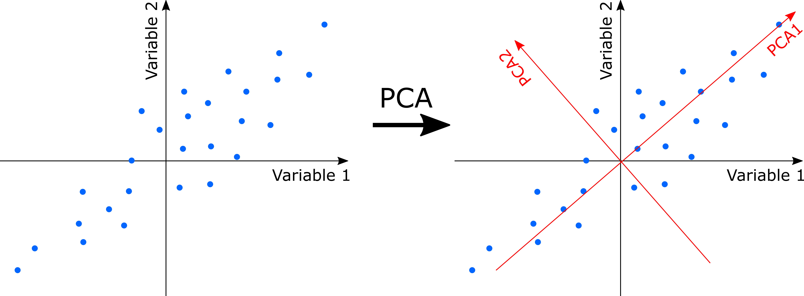
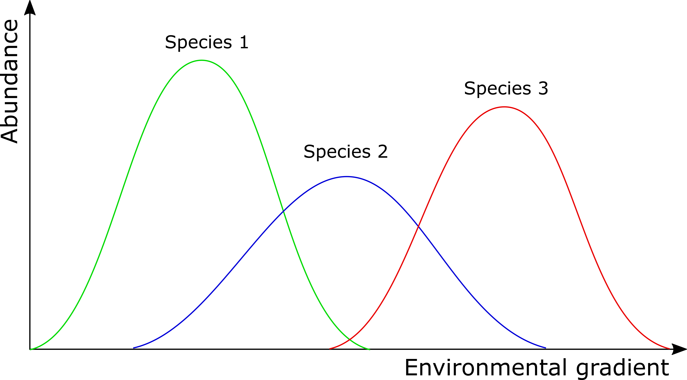
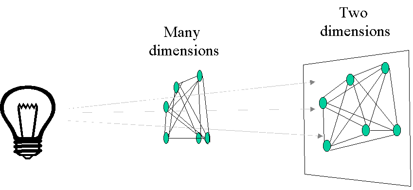

```{r setup, include=FALSE}
knitr::opts_chunk$set(echo = TRUE)
library(vegan)
library(ape)
library(tidyverse)
```

## Purpose
This is a follow-along document reporting my engagement with Coding Club's [Introduction to ordination](https://ourcodingclub.github.io/tutorials/ordination/index.html) tutorial. Not everything in the tutorial should be expected to be replicated here.

## Tutorial aims
In this tutorial, we will learn to use ordination to explore patterns in multivariate ecological datasets. We will mainly use the vegan package to introduce you to three (unconstrained) ordination techniques: Principal Component Analysis (PCA), Principal Coordinate Analysis (PCoA) and Non-metric Multidimensional Scaling (NMDS).

## 1. What is ordination?

### Goals of ordination

Ordination is a collective term for multivariate techniques which summarize a multidimensional dataset in such a way that when it is projected onto a low dimensional space, any intrinsic pattern the data may possess becomes apparent upon visual inspection (Pielou, 1984).

In ecological terms: Ordination summarizes community data (such as species abundance data: samples by species) by producing a low-dimensional ordination space in which similar species and samples are plotted close together, and dissimilar species and samples are placed far apart. Ideally and typically, dimensions of this low dimensional space will represent important and interpretable environmental gradients.

Generally, ordination techniques are used in ecology to describe relationships between species composition patterns and the underlying environmental gradients (e.g. what environmental variables structure the community?). Two very important advantages of ordination is that 1) we can determine the relative importance of different gradients and 2) the graphical results from most techniques often lead to ready and intuitive interpretations of species-environment relationships.

To give you an idea about what to expect from this ordination course today, we’ll run the following code.
```{r}
# Load the community dataset wich we'll use in the examples today
data(varespec)

# Open the dataset and look if you can find any patterns
# It is probably very difficult to see any patterns by just looking at the data frame!

# With this command, you'll perform a NMDS and lot the results.
varespec %>% 
  metaMDS(trace = F) %>% 
  ordiplot(type = 'none') %>% 
  text('sites')
```

### Ordination vs. classification
Ordination and classification (or clustering) are the two main classes of multivariate methods that community ecologists employ. To some degree, these two approaches are complementary. Classification, or putting samples into (perhaps hierarchical) classes, is often useful when one wishes to assign names to, or to map, ecological communities. However, given the continuous nature of communities, ordination can be considered a more natural approach. Ordination aims at arranging samples or species continuously along gradients.

If you want to know how to do a classification, please check out our Intro to data clustering.

## 2. Different ordination techniques
In this section you will learn more about how and when to use the three main (unconstrained) ordination techniques:

+ Principal Component Analysis (PCA)
+ Principal Coordinate Analysis (PCoA)
+ Non-metric Multidimensional Scaling (NMDS)

### 2a. Principal Component Analysis (PCA)
PCA uses a rotation of the original axes to derive new axes, which maximize the variance in the data set. In 2D,  this looks as follows:



Computationally, **PCA is an eigenanalysis**. The most important consequences of this are:

+ There is a unique solution to the eigenanalysis.
+ The axes (also called principal components or PC) are orthogonal to each other (and thus independent).
+ Each PC is associated with an eigenvalue. The sum of the eigenvalues will equal the sum of the variance of all variables in the data set. The eigenvalues represent the variance extracted by each PC, and are often expressed as a percentage of the sum of all eigenvalues (i.e. total variance). The relative eigenvalues thus tell how much variation that a PC is able to ‘explain’.
+ Axes are ranked by their eigenvalues. Thus, the first axis has the highest eigenvalue and thus explains the most variance, the second axis has the second highest eigenvalue, etc.
+ There are a potentially large number of axes (usually, the number of samples minus one, or the number of species minus one, whichever is less) so there is no need to specify the dimensionality in advance. However, the number of dimensions worth interpreting is usually very low.
+ Species and samples are ordinated simultaneously, and can hence both be represented on the same ordination diagram (if this is done, it is termed a biplot)
+ The variable loadings of the original variables on the PCA’s may be understood as how much each variable ‘contributed’ to building a PC. The absolute value of the loadings should be considered as the signs are arbitrary.

In most applications of PCA, variables are often measured in different units. For example, PCA of environmental data may include pH, soil moisture content, soil nitrogen, temperature and so on. For such data, the data must be standardized to zero mean and unit variance. For ordination of ecological communities, however, all species are measured in the same units, and the data do not need to be standardized.

Let´s have a look how to do a PCA in R. You can use several packages to perform a PCA: The rda() function in the package vegan, The prcomp() function in the package stats and the pca() function in the package labdsv. We will use the rda() function and apply it to our varespec dataset.
```{r}
PCA <- rda(varespec, scale = FALSE)
# Use scale = TRUE if your variables are on different scales (e.g. for abiotic variables).
# Here, all species are measured on the same scale 
# So use scale = FALSE

# Now plot a bar plot of relative eigenvalues. This is the percentage variance explained by each axis
barplot(as.vector(PCA$CA$eig)/sum(PCA$CA$eig))
# How much of the variance in our dataset is explained by the first principal component?

# Calculate the percent of variance explained by first two axes
sum((as.vector(PCA$CA$eig)/sum(PCA$CA$eig))[1:2])

# Also try to do it for the first three axes
sum(as.vector(PCA$CA$eig/sum(PCA$CA$eig))[1:3])

# Now, we`ll plot our results with the plot function
plot(PCA)
plot(PCA, display = 'sites', type = 'points')
plot(PCA, display = 'species', type = 'text')

# Try to display both species and sites with points.
plot(PCA, display = c('sites', 'species'), type = 'points')
```

```{r}
# You can extract the species and site scores on the new PC for further analyses:
sitePCA <- PCA$CA$u # Site scores
speciesPCA <- PCA$CA$v # Species scores

# In a biplot of PCA, species' scores are drawn as arros that point in the direction of increasing values for that variable.
biplot(PCA, choices = c(1,2), type = c('text', 'points'), xlim = c(-5, 10))
biplot(PCA, choices = c(1,3), type = c('text', 'points'), xlim = c(-5, 10))
```

In contrast to some of the other ordination techniques, species are represented by arrows. This implies that the abundance of the species is continuously increasing in the direction of the arrow, and decreasing in the opposite direction. Thus PCA is a linear method. PCA is extremely useful when we expect species to be linearly (or even monotonically) related to each other. Unfortunately, we rarely encounter such a situation in nature. It is much more likely that species have a unimodal species response curve:



### 2b. Principal Coordinate Analysis (PCoA)
Principal coordinates analysis (PCoA, also known as metric multidimensional scaling) attempts to represent the distances between samples in a low-dimensional, Euclidean space. In particular, it maximizes the linear correlation between the distances in the distance matrix, and the distances in a space of low dimension (typically, 2 or 3 axes are selected). The PCoA algorithm is analogous to rotating the multidimensional object such that the distances (lines) in the shadow are maximally correlated with the distances (connections) in the object:



The first step of a PCoA is the construction of a **(dis)similarity matrix**. While PCA is based on Euclidean distances, PCoA can handle (dis)similarity matrices calculated from quantitative, semi-quantitative, qualitative, and mixed variables. As always, the choice of (dis)similarity measure is critical and must be suitable to the data in question. If you want to know more about distance measures, please check out our [Intro to data clustering](https://ourcodingclub.github.io/tutorials/data-clustering/index.html#Distance). For abundance data, Bray-Curtis distance is often recommended. You can use Jaccard index for presence/absence data. When the distance metric is Euclidean, PCoA is equivalent to Principal Components Analysis. Although PCoA is based on a (dis)similarity matrix, the solution can be found by eigenanalysis. The interpretation of the results is the same as with PCA.
```{r}
# First step is to calculate a distance matrix.
# Here we use Bray-Curtis distance metric.
dist <- vegdist(varespec, method = 'bray')

# PCoA is not included in vegan. 
# We will use the ape package instead
PCOA <- pcoa(dist)

# Plot the eigenvalues and interpret
barplot(PCOA$values$Relative_eig[1:10])

# Can you also calculate the cumulative explained variance of the first 3 axes?
sum(PCOA$values$Relative_eig[1:3])

# Some distance measures may result in negative eigenvalues. In that case, add a correction:
PCOA <- pcoa(dist, correction = 'cailliez')

# Plot your results
biplot.pcoa(PCOA)

# You see what`s missing?  Indeed, there are no species plotted on this biplot.  That's because we used a dissimilarity matrix (sites x sites)  as input for the PCOA function.  Hence, no species scores could be calculated.  However, we could work around this problem like this:
biplot.pcoa(PCOA, varespec)
```


